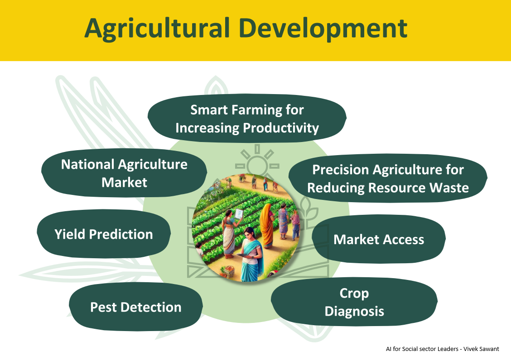

# AI and ML for Mechanical Engineering (AIML4ME)

Welcome to the *AI and ML for Mechanical Engineering* course! 

This course is designed to introduce mechanical engineering students to the foundational concepts, tools, and techniques of machine learning. By bridging the gap between traditional engineering principles and modern AI methodologies, the course equips learners with the skills needed to tackle real-world problems mainly targeting Agriculture. 

With hands-on coding assignments, practical projects, and an emphasis on mathematical rigor, this course offers a comprehensive learning experience tailored for engineers aspiring to excel in the rapidly evolving field of machine learning.

---

## Course Logistics
- **Instructor**: Yogesh H Kulkarni (Visiting Faculty, CoEP)
- **Email**: firstnamelastname [at] yahoo [dot] com (Subject "AIML4ME...")
- **Phone**: nine eight nine zero two five one four zero six (for SMS/WhatsApp)
- **Class**: Final Year B.Tech Mech 8th Semester, Elective (Jan-Apr)
- **Venue**: UG-Class Room 301 (Bajaj Building 3rd Floor)
- **Timing**: Fridays 10:30 am to 12:30 pm (2hrs, other 1 hour is by other faculty)
- **Course Objectives**
	- To understand the basic concepts of Machine Learning
	- To study various Machine Learning techniques and implement them
	- To apply learnt knowledge to Agricultural Engineering problems
- **Details**
	- TextBook: None. Topic-wise course material available on the Github repository.
	- Have a personal Python environment. Get charged laptop to the class, if possible
	- Backup code: Use Google Drive or another backup service.
	- Communication: Google Hangout/Space (coming soon).
	- Attendance: Strongly advised.

---

## Pre-requisites

### **Skills Required**
- Programming: Any high level programming language such as C/C++, Java, etc.
- Mathematics: Linear Algebra, Statistics, Probability, Calculus, etc.

**Reference:** [How to become a Data Scientist? - Yogesh Kulkarni](https://medium.com/technology-hits/how-to-become-a-data-scientist-f673a30cafcd)

---

## Evaluation (Subject to Change)

### **Assessment Methods**
- Assignments: 4-5 coding assignments.
- Projects: T1 and T2 coding projects.
- Exams: (TBD) Mid-sem and final exam with written and coding questions.

---

## Academic Integrity Policy

### **Guidelines**
- The course is for your learning.
- Build your own thinking.
- **Always** cite sources.
- Avoid generating code by Gen AI; copying verbatim; use your own code/words.

<!-- 
## Warm-up

### **Exercises**
1. Write compilable code for Fibonacci Series (10 lines).
2. What is Machine Learning? Your thoughts (5 lines).

### **Projects**
- [Predicting Crop Yields](https://www.youtube.com/watch?v=vGOvUoqn_M8)
- [Crop Recommendation System](https://www.youtube.com/watch?v=_R9Q_iuyvdc)
- [Mastering Crop Disease Classification - CNN](https://www.youtube.com/watch?v=_TGjYaSnydQ)
- [Potato Disease Classification: Deep Learning CNN](https://www.youtube.com/playlist?list=PLeo1K3hjS3ut49PskOfLnE6WUoOp_2lsD)

--- -->

[Lessons Plan](./README_Course_AIML4ME_lessonplan.md)